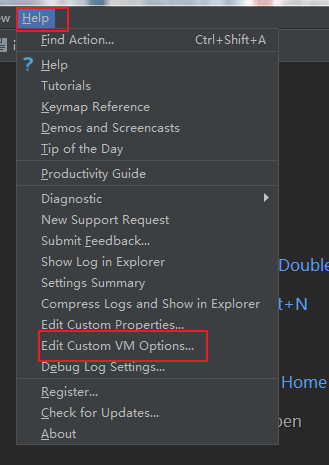
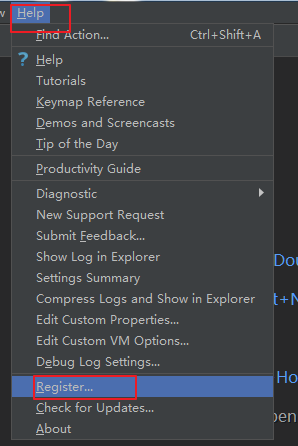

#   问题记录

## 环境安装及工具问题

### 工具
`phpstrom` +微信开发者工具（vscode）+`Insomnia`+`SQLyog` 
### xampp安装
1. 默认安装，一路回车
2. 检测是否安装成功

   - start appach ，网页输入local，显示xampp页面即安装成功
   - start mysql ， cd到xampp安装目录，进入mysql>bin目录 
      输入`mysql -uroot -p` 登录数据库，默认密码为空；
      输入`show databases`即可查看数据库
      

### ThinkPHP 安装

1.  安装
  
  - 安装两个包： framework,think
  - 解压包复制到`xampp`安装目录`htdocs`文件夹中
    + `htdocs`是网站根目录

### phpstrom

  phpstrom  破解安装方法

https://www.jianshu.com/p/f404994e2843
- 两个坑的地方

``

``

## 项目配置

### 项目命名
 
 1. 服务器： tinyServer
 2. 小程序： hotSell
 3. cms名称：admin

###  搭建基本服务器TP5框架
 1. 将htdocs文件夹下的 think文件夹改为`tinyServer`，将`framework`文件
 名改为`thinkphp`
 
 2. 测试是否安装成功，网页输入：`http://localhost/tinyServer/public/`
 

### TP5 层次结构

1. 入口文件  index.php，入口文件可以有多个
2. 应用：包含多个模块，application就是应用目录
    - public 文件下index.php定义默认应用目录
    - 模块内部就是MVC，包含controller，view，model（业务层）
   

